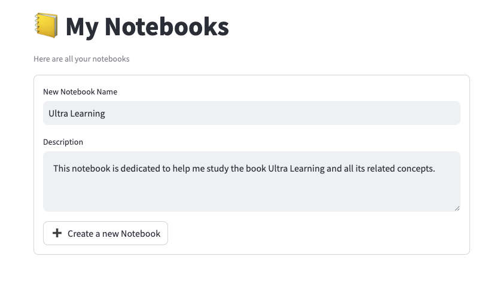
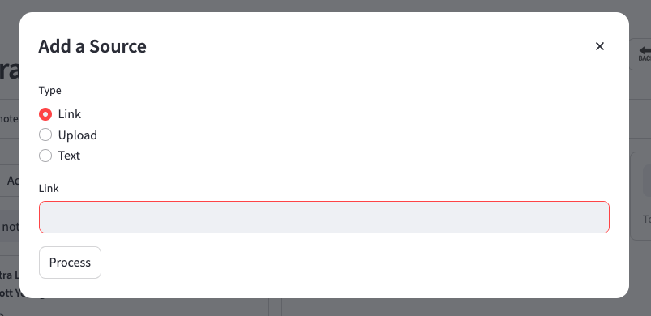
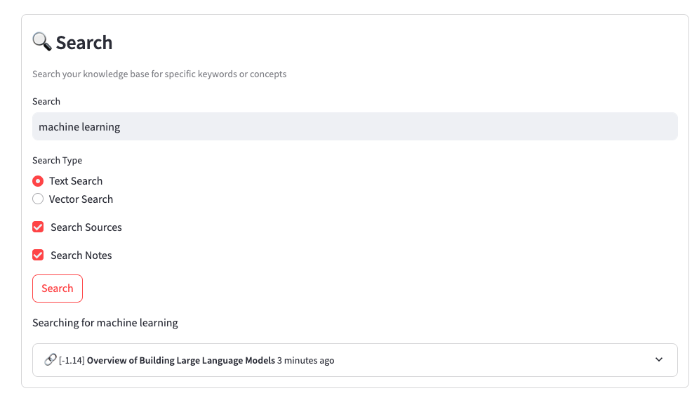

# Using Open Notebook

This first release of Open Notebook is inspired by Notebook LM, so you will find a very similar workflow.

## Creating a new notebook

Just type a name and description for the Notebook and you are good to go. Make the description as detailed as possible since it will be used by the LLM to understand the context of the notebook and provide you with better answers.

## Adding sources

Just click on Add Source and enter the URL, upload the file or paste the content of your source.

You'll find your new source in the first column of the Notebook Page.

## Talk to the Assistant

Once you have enough content in the notebook, you can decide which of them will be visible to LLM before sending your question. 

- Not in Context: LLM won't get this as part of the context
- Summary: LLM will get the summary for the content and can ask for the full document if desired
- Full Content: LLM will receive the full transcript of the content together with your question. 

It's recommended that you use the least amount of context so that you can save up on your API spend.

## Making Notes

There is 2 ways you can make notes: 

Manually by clicking on New Note

Or by turning any LLM message into a Note. 

## Searching

The search page gives you a glance of all the notes you have made and the sources you have added. You can query the database both by keyword as well as using the vector search. 

